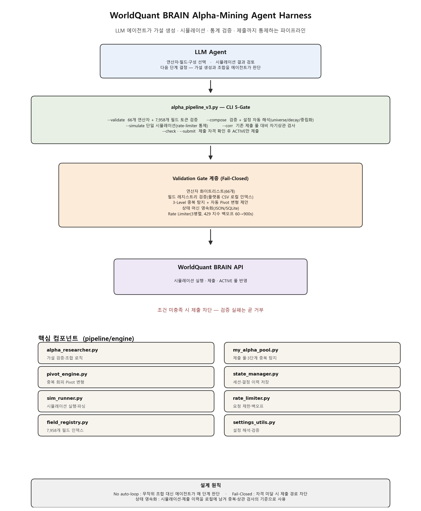

# quant-alpha-agent-harness — WorldQuant BRAIN 알파 마이닝 에이전트 하네스

> LLM 에이전트가 가설 생성부터 시뮬레이션, 통계 검증, 제출까지 전 과정을 통제하는 WorldQuant BRAIN 알파 마이닝 하네스다. 무작위 조합이 아니라 에이전트가 단계마다 판단한다.

## ⭐ 성과

- **유효 알파 70개 발굴**, 플랫폼 기준을 통과하는 시그널을 꾸준히 확보했다(제출 기록 14건)
- **통계 가드레일 + 5-Gate 제출 파이프라인**, 자격 미달 알파는 아예 제출 경로가 막히는 Fail-Closed 구조다
- **리서치 컨설턴트 계약 체결**, WorldQuant 산하 컨설턴트와 실전 운영
- **NDA-safe 공개**: 개별 알파 수식과 데이터셋 카탈로그는 플랫폼 규정에 따라 공개하지 않는다. 에이전트 제어 프레임워크만 공개 범위다.

## 검증 대상 질문

"LLM 에이전트가 실제로 유효한 알파 시그널을 발굴할 수 있는가?"

무작위 조합(auto-loop)이 아니라 에이전트가 조합·검토·제출을 결정하는 대화형 마이닝 워크플로우다. 검증은 두 가지를 본다.

1. 에이전트의 표현식 생성이 통계적으로 의미 있는가 (단순 조합 대비)
2. 에이전트의 제출 판단이 가드레일을 통과하는가 (Fail-Closed)

## 시스템 설계

<p align="center">
  
</p>


**설계 원칙**

- **No auto-loop**: 무작위 조합을 돌리는 게 아니라 에이전트가 매 단계 판단한다
- **Fail-Closed**: 조건을 채우지 못하면 제출을 차단한다(중복·토큰·설정 검증 실패는 곧 거부)
- **상태 영속화**: 시뮬레이션·제출 이력이 로컬에 남아 중복·상관 검사의 기준이 된다

## 핵심 컴포넌트

| 모듈 | 역할 |
|---|---|
| `alpha_researcher.py` | 가설 검증·조합 로직(에이전트 통제) |
| `pivot_engine.py` | 중복을 피하는 Pivot 변형 생성 |
| `my_alpha_pool.py` | 제출 풀 관리와 3단계(정확/구조/시그니처) 중복 탐지 |
| `state_manager.py` | 세션·결정 이력을 파일/DB에 저장 |
| `sim_runner.py` | 시뮬레이션 실행·결과 파싱 |
| `field_registry.py` | 7,958개 필드 로컬 인덱스 |
| `rate_limiter.py` | 3병렬 + 429 지수 백오프 |

## 검증

- **가드레일 실증**: pytest 4개 스위트(알파 리서처 조합, 필드 레지스트리 로딩, Pivot 엔진, 상태 관리자)
- **중복 방지**: 제출 풀을 상대로 정확·구조·시그니처 3단계로 겹침을 찾고, 구조적 중복이면 Pivot 변형을 자동 제안한다
- **제출 파이프라인**: 5-Gate를 통과해야 `POST /alphas/{id}/submit`이 가능하고, ACTIVE 상태만 풀에 반영된다

## 저장소 구조

```
pipeline/
  alpha_pipeline_v3.py     # CLI 오케스트레이터 (5-Gate)
  simulate.py / submit.py  # 단일 알파 시뮬레이션·제출 래퍼
  list_active.py           # ACTIVE 알파 조회
  download_fields.py       # 플랫폼 필드 카탈로그 로컬 동기화
  engine/                  # 에이전트·중복 탐지·상태 관리·레이트리밋
  tests/                   # pytest 4개 스위트
```

## License

프레임워크: MIT. 플랫폼 데이터·알파 수식은 WorldQuant BRAIN 이용약관 적용.
